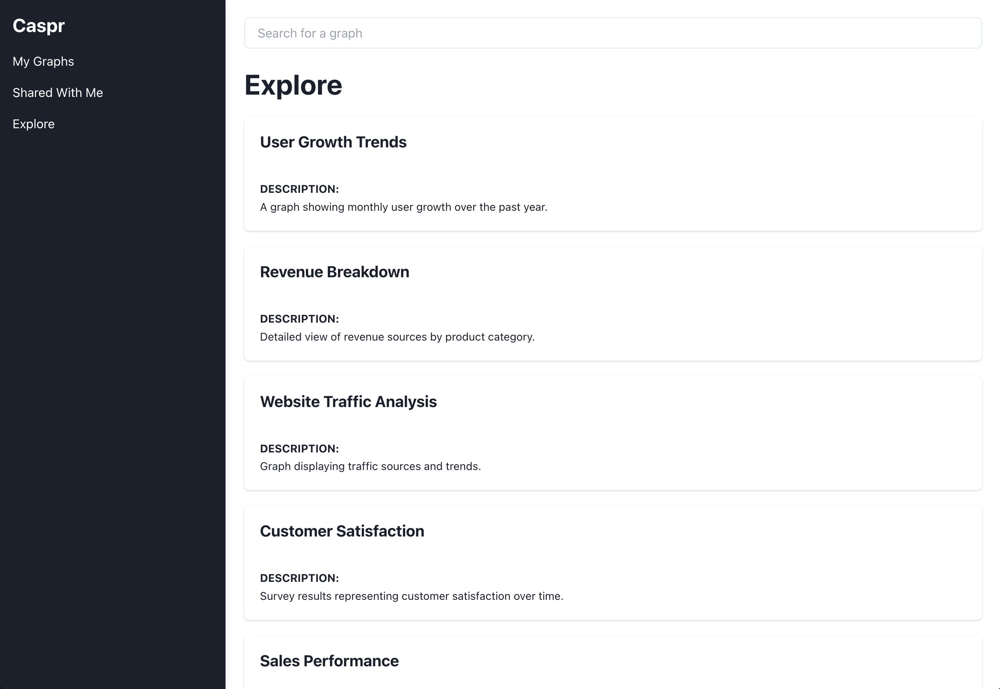
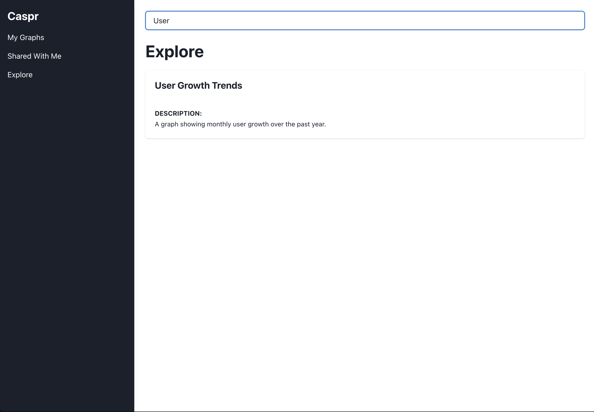
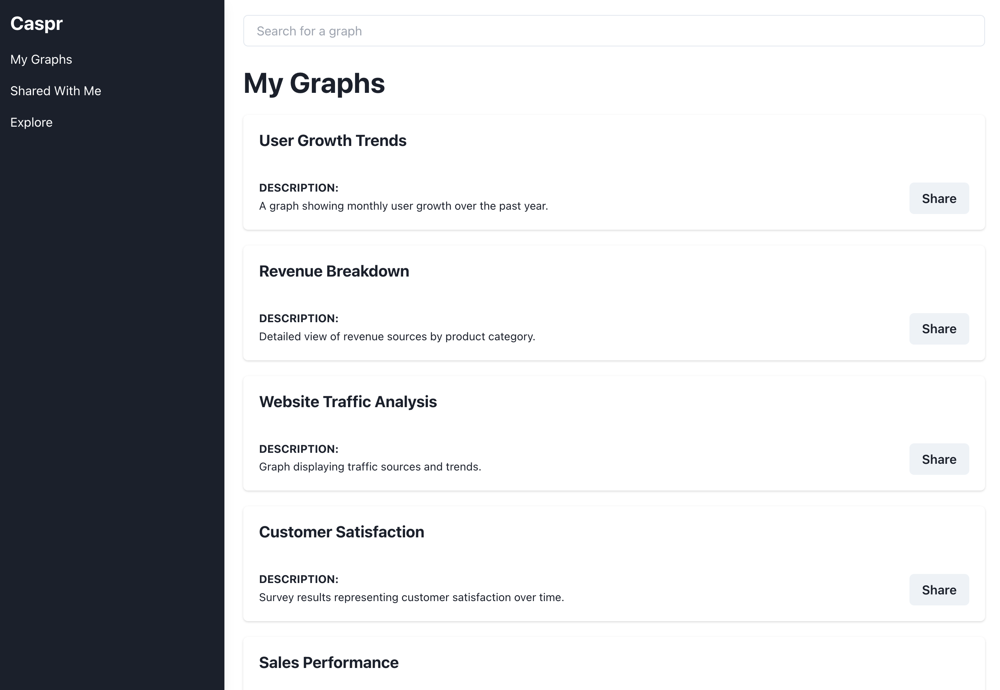
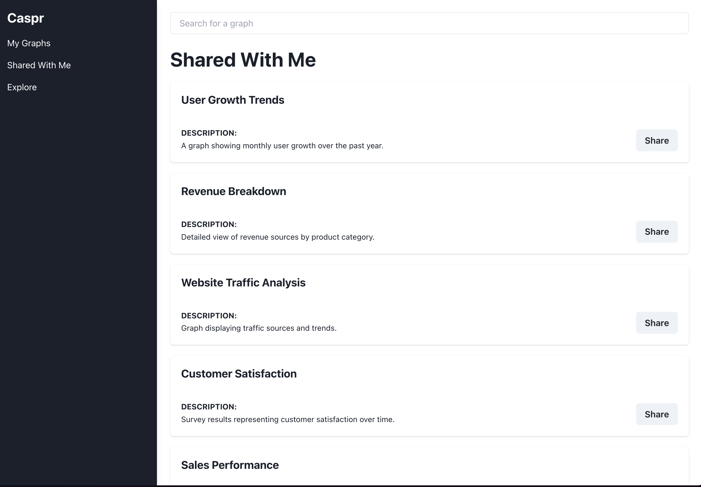

## Intro

This README will detail the components and elements for subteam 2's submissions. The deployed version of the application can be found at: 

Note that due to limitations on projects on a free-tier of Vercel, we kindly as the TA to sign into vercel using the team credentials provided in Quercus. As a result, they will be able to view each of the subteam's deployments separately without incurring additional cost to the team.

Some prerequisities include
1. Git
2. npm

## Getting Started

Pull the git repository via command

```bash
git clone https://github.com/csc301-2024-f/project-19-Machine-Learning-Group.git
```

Next checout the D2-3 branch
```
git checkout D2-3
```

We can now run the developmental version of the application by running the following commands

```bash
cd frontend
npm install
npm run dev
```

Open [http://localhost:3000](http://localhost:3000/searchPage) with your browser to see the result.

To verify the integrity of our components we included a series of tests in `frontend/__tests__`
```
npm test
```
will run tests in your terminal.

## Detailed Description

Our subteam covered the following main components
1. Created 3 different views of graph meatadata (Own Graphs, Shared with Me and Explore)
2. Create a search-bar which allows users to filter for specific keywords in title and description
3. Fetech graph metadata from Firebase
4. Allow users to share graphs with others




